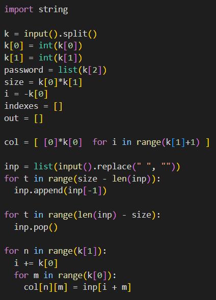
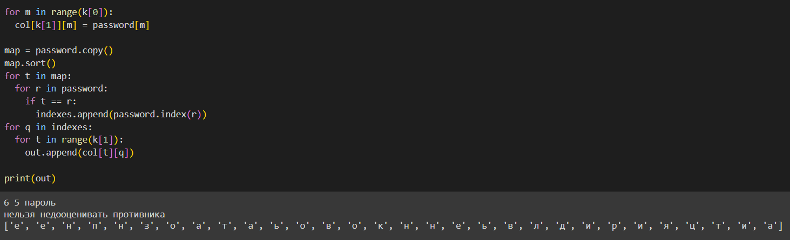
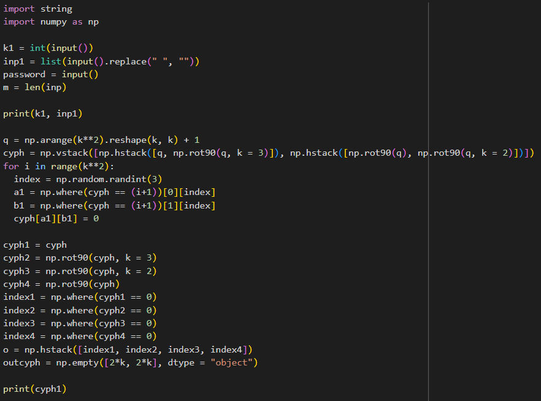
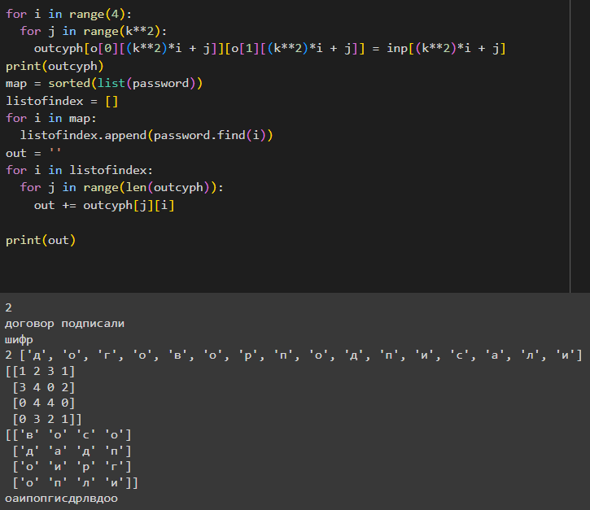
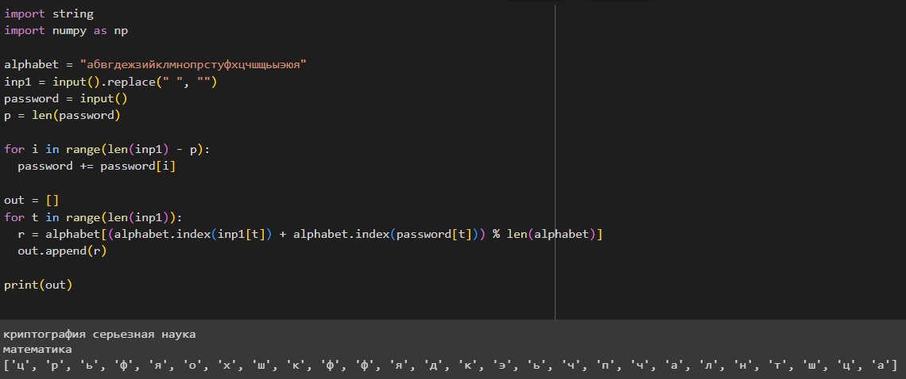

---
## Front matter
lang: ru-RU
title: Лабораторная работа №2
subtitle: Математические основы защиты информации и информационной безопасности
author:
  - Дэнэилэ Александр Дмитриевич
institute:
  - Российский университет дружбы народов, Москва, Россия
  - НПМмд-02-23
date: 30 сентября 2023

## i18n babel
babel-lang: russian
babel-otherlangs: english

## Fonts
mainfont: PT Serif
romanfont: PT Serif
sansfont: PT Sans
monofont: PT Mono
mainfontoptions: Ligatures=TeX
romanfontoptions: Ligatures=TeX
sansfontoptions: Ligatures=TeX,Scale=MatchLowercase
monofontoptions: Scale=MatchLowercase,Scale=0.9

## Formatting pdf
toc: false
toc-title: Содержание
slide_level: 2
aspectratio: 169
section-titles: true
theme: metropolis
header-includes:
 - \metroset{progressbar=frametitle,sectionpage=progressbar,numbering=fraction}
 - '\makeatletter'
 - '\beamer@ignorenonframefalse'
 - '\makeatother'
---

# Шифры перестановки

## Цель лабораторной работы

Изучить шифры перестановки.

## Задачи лабораторной работы

1. Реализовать шифр маршрутным способом.
1. Реализовать шифр с помощью решеток.
1. Реализовать шифр с помощью таблицы Виженера.

# Ход лабораторной работы

## Маршрутное шифрование

1. Реализуем шифр маршрутным способом. (рис. @fig:001)(рис. @fig:002).

{#fig:001}
{#fig:002}

1. Реализуем шифр с помощью решеток. (рис. @fig:003)(рис. @fig:004).

{#fig:003}
{#fig:004}

1. Реализуем шифр с помощью таблицы Виженера. (рис. @fig:005).

{#fig:005}

## Выводы

Были изучены шифры перестановки на примере маршрутного шифра, шифра с помощью решеток и шифрования с помощью таблицы Виженера.

